# India- A History Quiz 
 
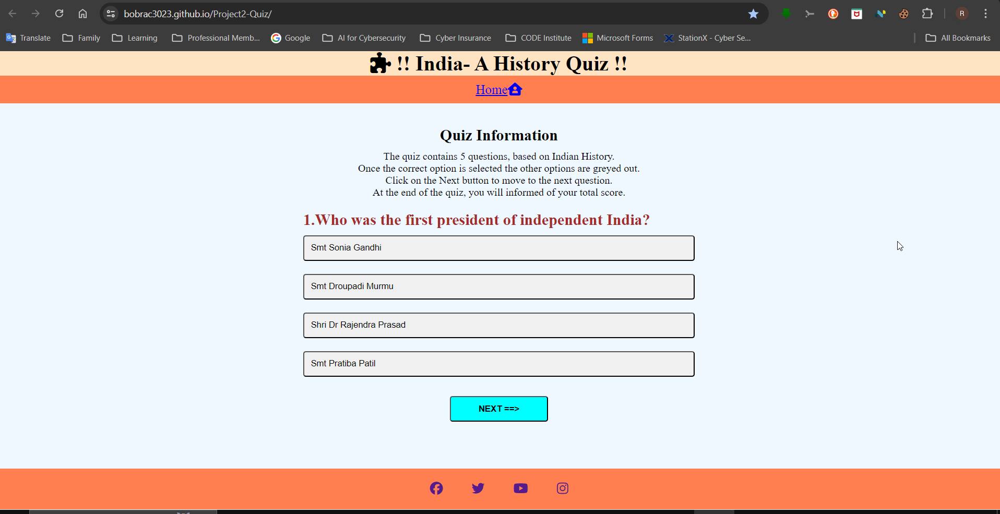

## Introduction 
The project is conceived to test users knowledge on leaders who shaped India,right after independence from British rule. 
The quiz will appeal to anyone with an active interest in Indian political history,dating back to the mid nineteenth centur.
The quiz should tickle one's curiosity, to understand the roles played by these towering peronalities in shaping India, as we see it today.  

## Features 
 -The project is written in HTML to define the structure, CSS for styling and Javascript to provide the logic.  
 -Its main page includes a title, a nav bar, the quiz area and a footer.  
 -The quiz area includes a **question** section, **answer** section and a **next** button.  
 -It presents the user with a set of **5 questions** and **4 answer options** to select from.  
 -A **right** or **wrong** selection provides **visual representation** by change in color and an **alert pop-up**.  
 -The answer options presented **grey out** after **any one** answer option is selected.  
 -This grey out feature is **enabled** irrespective of a **right or wrong answer** choice.  
 -The user has the option to **skip** a particular question **or** multiple questions.  
 -The **Next button** allows the user to move to the next set of question and answers.  
 -At the end of **5 questions**,the **total score** is computed and presented to the user.  
 -The user is also presented with the right answers with a clickable link that takes it to an external Wikipedia page.  
 -Emphasis is more on Javascript and how it can be used to manipualte the DOM and style the CSS.  
 -Judicous use of functions, object literals,constants, array and template literal make the code an easy read.  
 -Extensive use of commands **GetElement**, **inneHTML**, **classlists** .  
 -Overall the flow of code is kept simple and **relevant comments** provided for better understanding and **intepretation**.  

### Existing Features

- __File_structure__

  -Three main project files created using statndard naming conventions.  
  -**index.html** for HTML,**style.css** for CSS and **script.js** for Javascript.
  -assets folder holds tthe **css**, **images** and **js** sub-folders.  
  -All relevant images for favicon and readme stored in he **images** sub-folder.  

- __Head_element__

  -Language for the website is **US English**.  
  -Meta tags and viewport included to make page responsive.
  -Author and keywords included for serach engine optimization.  
  -Links to favicon and CSS stylesheet includded.  
  -**favicon** details includes three different screen sizes.  
  -The title **Blue Heaven Quiz Master** defined here.  

  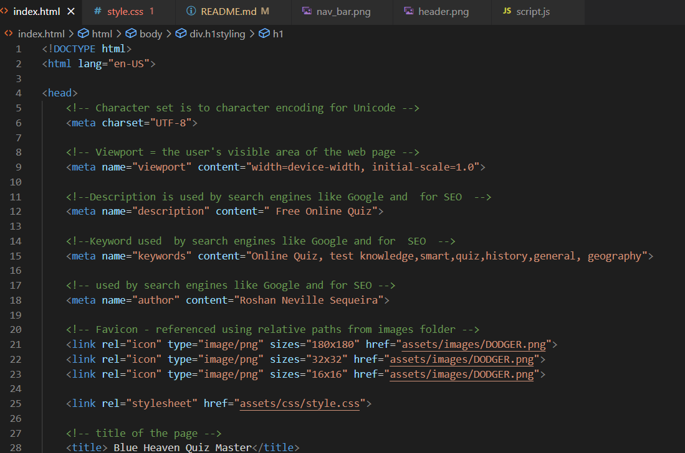

- __Header__
         
  -The Header contains the **H1** nested inside the **Body** element.  
  -It displays a logo of a **piece of puzzle** downloaded from fontawesome website.  

  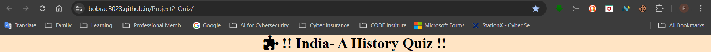
   
- __Navigation Bar__
   
  -The navigation bar design features one unordered list that is fully responsive.  
  -The responsive navigation bar includes links to the Logo of a **home** downloaded from **fontawesome** website. 

  

- __HTML Main Quiz Section__

  -The **quiz section** is dived into **two div elements**,**two h2**, **one Paragraph** and  **one button** element.  
  -The **first h2 and the paragraph element** is configured to provide the quiz information including instructions.  
  -The first div nexted inside the **main div** is referenced using a class **question-area**.  
  -Nested inside this div is the **h2 element** designed to **display the questions**, referenced by **id="quiz"**.  
  -The second div is referenced by **id="answer-buttons"**, designed to display the answers from the **object literals** defined in Javascript.  
  -The button element is referenced using an **"id=next-button"** to enable user to navigate to next set of questions.  
  -The button element is access and modified using Javacript to **dipslay the "Play-again"** button at the end of the quiz.  
  
  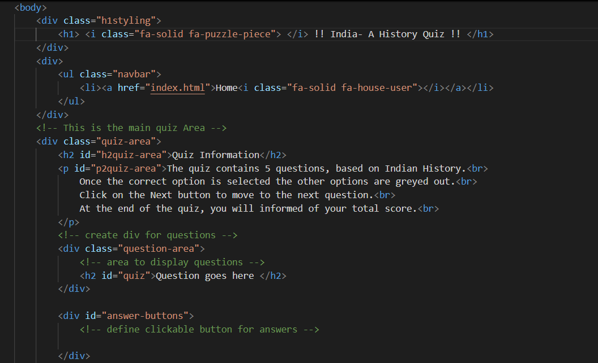

- __script js section__

  - As the emphasis of this project is on Javascript, it has been used extendsively to manipulate the HTML elements.  
  - There are a multiple functions that are part of the script. 
  - Each function is explained below.  
      -initiateQuiz- This function is to inititae the quiz.
      -displayQuestion- This function will display the questions from the array and answer options from object lterals.
      -resetState- to remove previous child elements.  
      -selectChoice- Actions to carry once user clicks on a particular answer.  
      -showScore- Actions to take to dispay final score.  
      -handleNextButton- Actions to take each time user clicks the **Next** button. 

- __The Footer__ 

  -The footer section includes links to the relevant social media sites for. 
  -For this project, they default to the login page of each social media icon.
  -All fonts were used from fontawesome website along with the reference links.
  -The links will open to a new tab to allow easy navigation for the user. 
  -The footer is valuable to the user as it encourages them to keep connected via social media.
  -all links were tested and found to be working fine. 

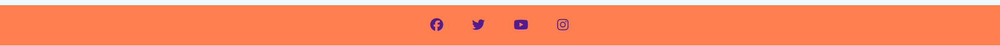
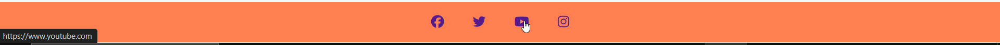
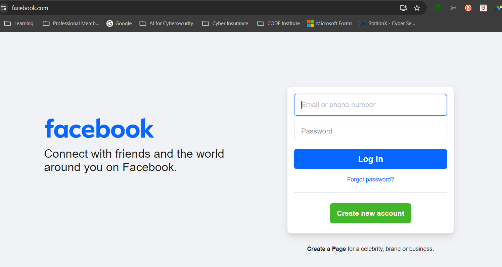

- __Images__

  -The images folder provides all supporting images referenced in this readment file.
  -The Favicon is also stored in this file. 
   

### Features Left to Implement

  -A timer for apprimately 15 mins.  
  -A progress bar.  

## Testing 

### Manual testing 
  -various manual tests were carried out to understand how the project functions. 

  -AsusLaptop with a screensize of 1920x1080
  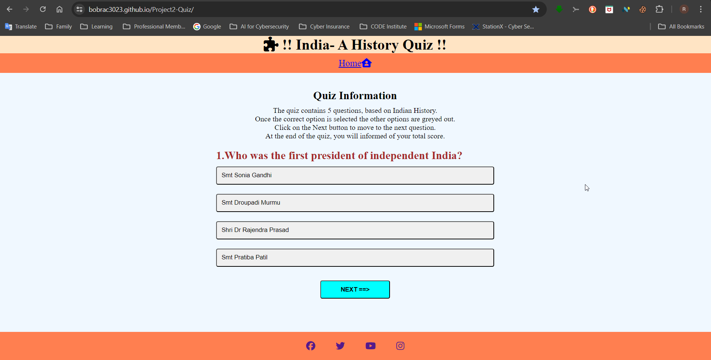 

  -AsusLaptop with a screensize of 1920x1080-Color change after user selects right answer 
  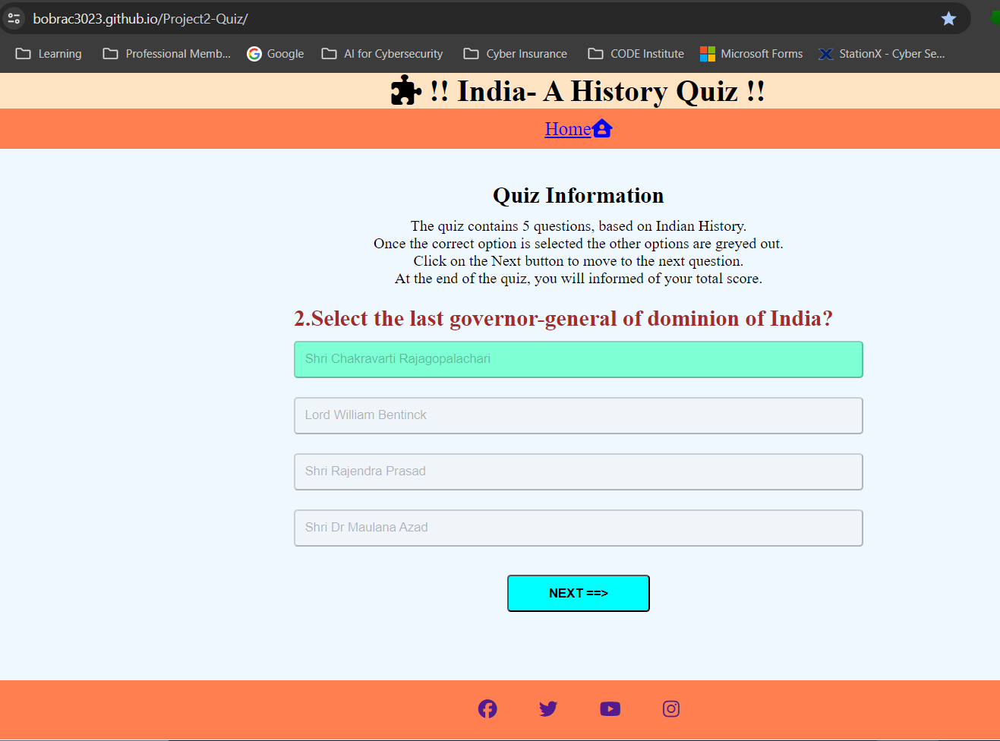

  -AsusLaptop with a screensize of 1920x1080-Pop up after user selects right answer 
  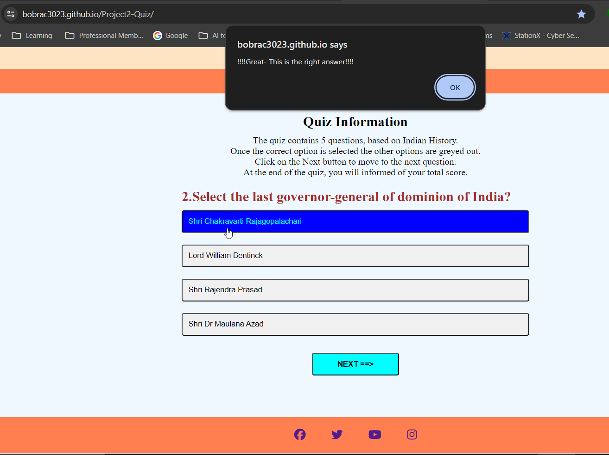

  -AsusLaptop with a screensize of 1920x1080-color change after user selects wrong answer
  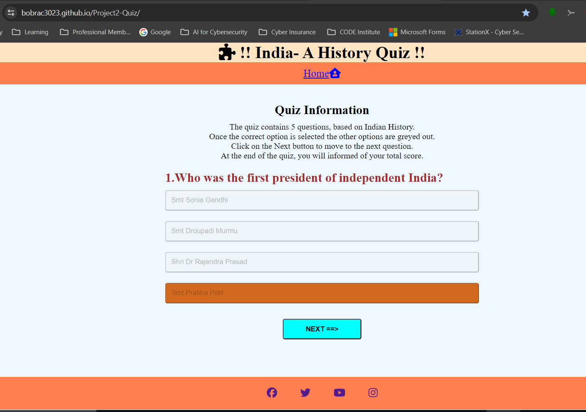

  -Samsung mobileA54 User opens link on mobile
  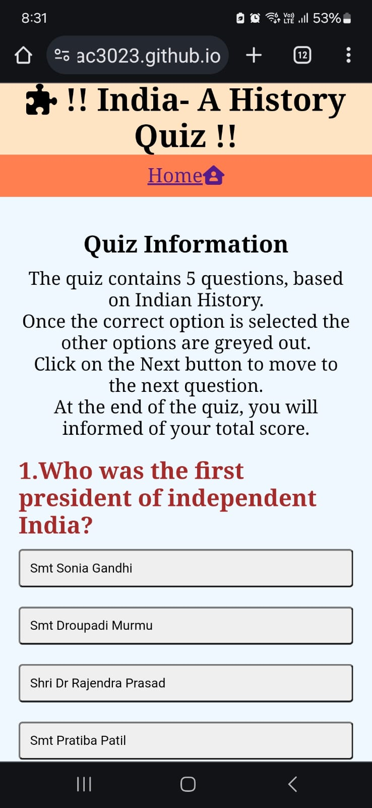

  -Samsung mobileA54 User clicks correct answer
  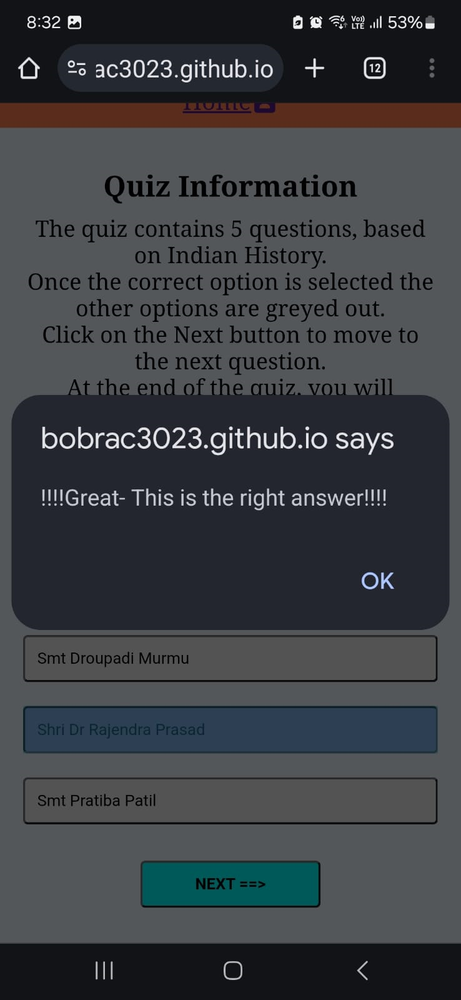
 
  -Samsung mobileA54 User clicks wrong answer
  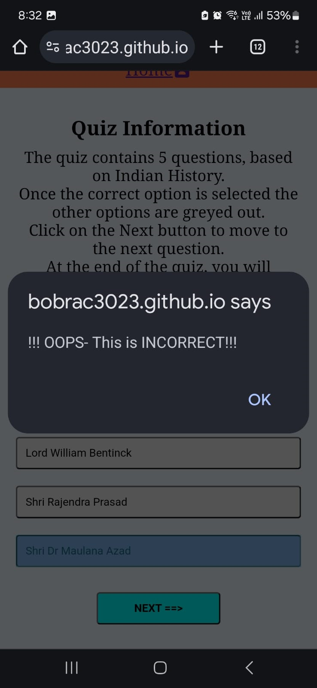

  -Samsung mobileA54 Final score on quiz completion
  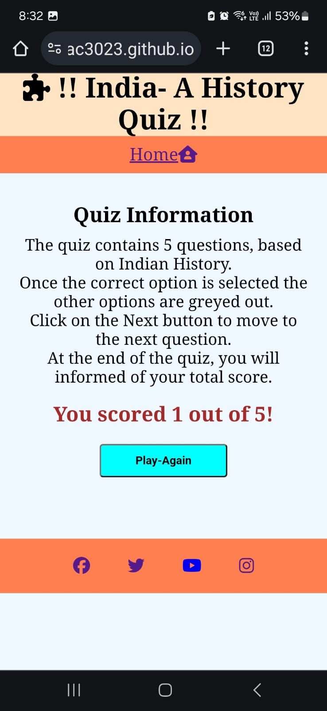

### Validator Testing 

- HTML
   -No errors were returned when passing through the official.[W3c validator](https://validator.w3.org/#validate_by_input)

   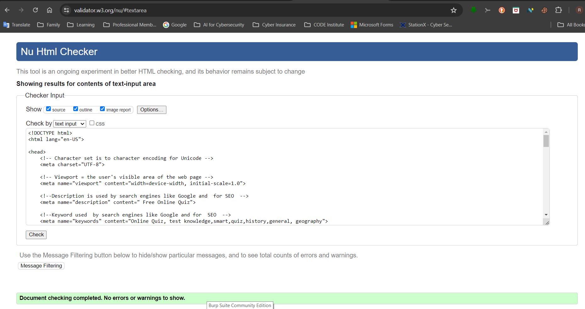

- CSS
   -No errors were found when passing through the official [(Jigsaw) validator](https://jigsaw.w3.org/css-validator/)

   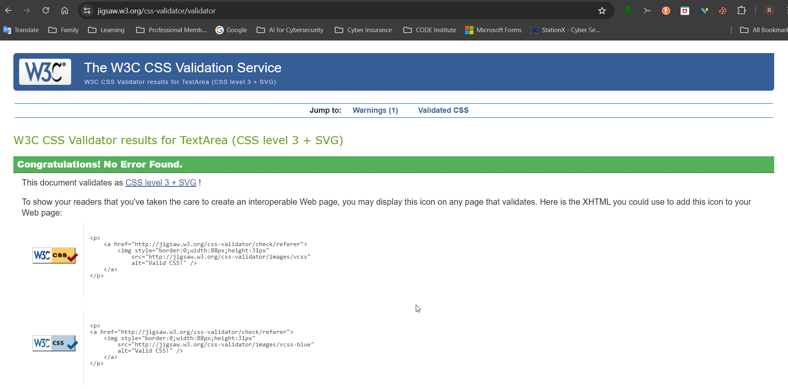

- JSHINT 
   -No errors were found when tested throgh the jshint testing site 

   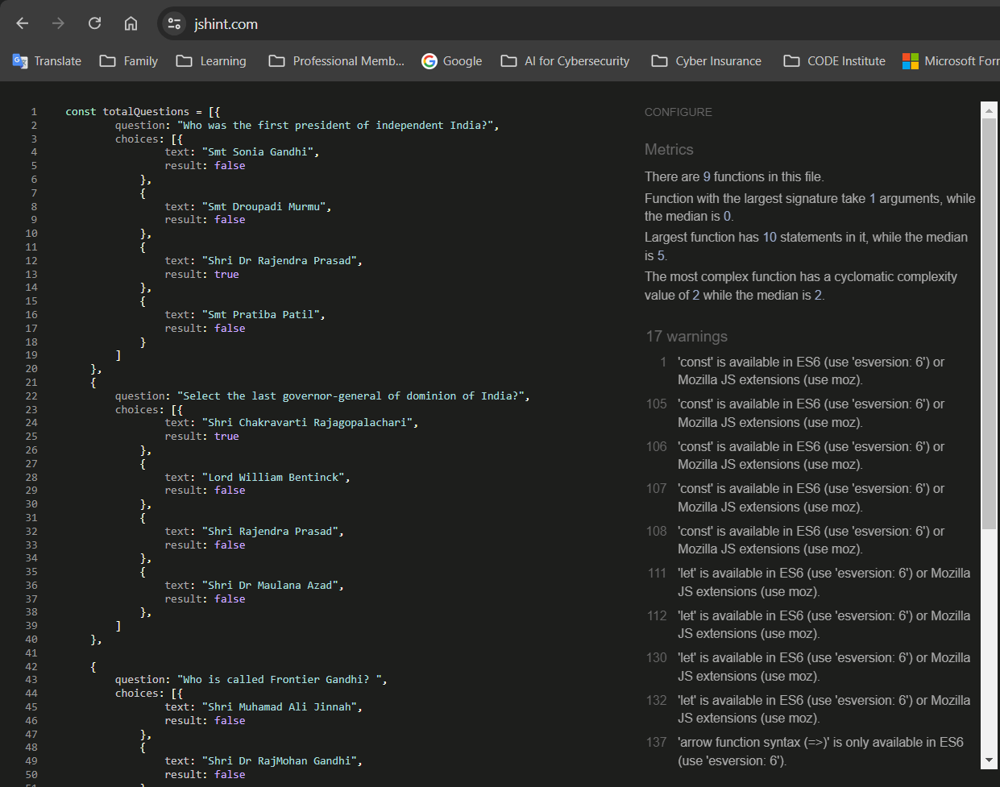

### Unfixed Bugs

You will need to mention unfixed bugs and why they were not fixed. This section should include shortcomings of the frameworks or technologies used. Although time can be a big variable to consider, paucity of time and difficulty understanding implementation is not a valid reason to leave bugs unfixed. 

## Deployment

  -The site was deployed to GitHub pages as follows: 
  -In the GitHub repository, navigate to the Settings tab, select pages, and change **Branch** to main hub from none.

  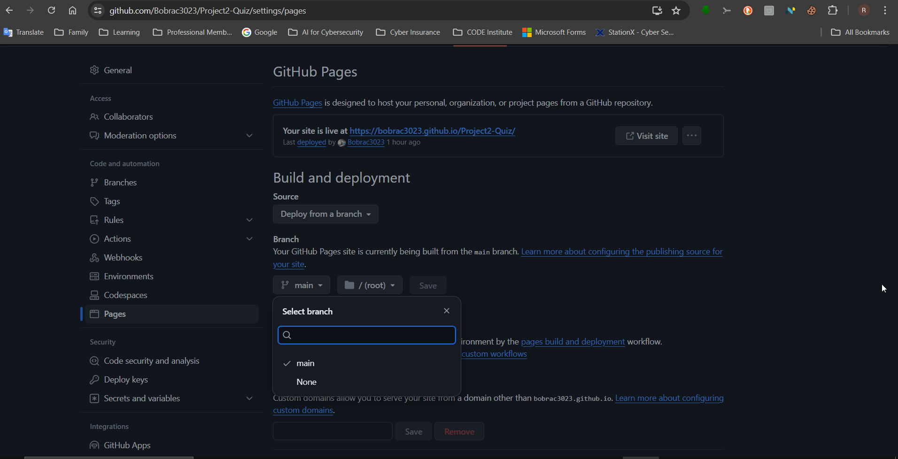

  -From the Actions tab, select Deployment to check deployment status and capture external link.

  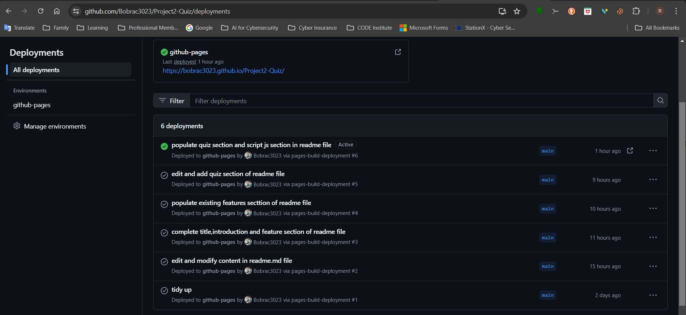

  -Once the master branch has been selected, the page will be automatically refreshed with a detailed ribbon display 
  to indicate the successful deployment. 

  -The live link can be found here - https://bobrac3023.github.io/Project2-Quiz/

## Credits 

  -Extra help to understand key Javascript scripts (https://www.youtube.com/watch?v=Hr5iLG7sUa0&list=PLu71SKxNbfoBuX3f4EOACle2y-tRC5Q37)
  -Understand how to design the quiz (https://www.sitepoint.com/simple-javascript-quiz/)
  -Understand var and const declarations (https://www.giraffeacademy.com/web-development/javascript/building-a-quiz/)

### Content 

  -How to design, structure and write code instructions taken from (https://www.youtube.com/watch?v=PBcqGxrr9g8)
  -The icons in the footer and header were taken from [Font Awesome](https://fontawesome.com/)

### Media

  -The photo used for Favicon is from the author's own cat
 

Congratulations on completing your Readme, you have made another big stride in the direction of being a developer! 

## Other General Project Advice

Below you will find a couple of extra tips that may be helpful when completing your project. Remember that each of these projects will become part of your final portfolio so it’s important to allow enough time to showcase your best work! 

- One of the most basic elements of keeping a healthy commit history is with the commit message. When getting started with your project, read through [this article](https://chris.beams.io/posts/git-commit/) by Chris Beams on How to Write  a Git Commit Message 
  - Make sure to keep the messages in the imperative mood 

- When naming the files in your project directory, make sure to consider meaningful naming of files, point to specific names and sections of content.
  - For example, instead of naming an image used ‘image1.png’ consider naming it ‘landing_page_img.png’. This will ensure that there are clear file paths kept. 

- Do some extra research on good and bad coding practices, there are a handful of useful articles to read, consider reviewing the following list when getting started:
  - [Writing Your Best Code](https://learn.shayhowe.com/html-css/writing-your-best-code/)
  - [HTML & CSS Coding Best Practices](https://medium.com/@inceptiondj.info/html-css-coding-best-practice-fadb9870a00f)
  - [Google HTML/CSS Style Guide](https://google.github.io/styleguide/htmlcssguide.html#General)

Getting started with your Portfolio Projects can be daunting, planning your project can make it a lot easier to tackle, take small steps to reach the final outcome and enjoy the process! 