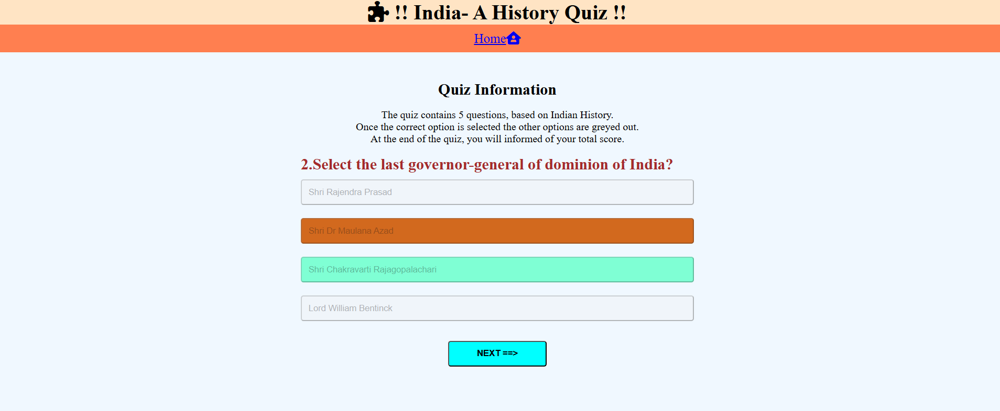

# India- A History Quiz 
 

## Introduction 
The project is conceived to test users knowledge on leaders who shaped India,right after independence from British rule. 
It will appeal to anyone with an active interest in Indian political history,dating back to the mid nineteenth centur.
The quiz should tickle one's curiosity, to understand the roles played by these towering peronalities in shaping India, as we see it today.The idea and concept behind this quiz is simple, yet powerful. One needs to think of this from an **if-else loop** perspective that is based on the simple premise- **if you know the answer, fine, else continue to iterate till the score is 5 on 5.** This thinking is also the reason that the quiz does not show the right answers, but invites the user to do their own research.    

## Features 
 -  The project is written in HTML to define the structure, CSS for styling and Javascript to provide the logic.  
 -  Its main page includes a title, a nav bar, the quiz area and a footer.  
 -  The quiz area includes a **question** section, **answer** section and a **next** button.
 -  The**Next** button is only visibile after the user select the answer to the first question.
 -  The questions and answers are configured to be displayed randomly, every time a user decides to play the game again.  
 -  It presents the user with a set of **5 questions** and **4 answer options** to select from.  
 -  A **right** or **wrong** selection provides **visual representation** by change in color and an **alert pop-up**.  
 -  The answer options presented **grey out** after **any one** answer option is selected.  
 -  This grey out feature is **enabled** irrespective of a **right or wrong answer** choice.  
 -  The user has the option to **skip** a particular question **or** multiple questions.  
 -  The **Next button** allows the user to move to the next set of question and answers.  
 -  At the end of **5 questions**,the **total score** is computed and presented to the user.  
 -  Emphasis is more on Javascript and how it can be used to manipualte the DOM and style the CSS.  
 -  Judicous use of functions, object literals,constants, array and template literal make the code an easy read.  
 -  Extensive use of commands like **GetElement**, **innerHTML**, **classlists**.  
 -  Overall the flow of code is kept simple and **relevant comments** provided for better understanding and **intepretation**.  

 ## Quiz flow explained in simple steps 

 - Page loads → initiateQuiz() function starts 
 - The user is show A question and 4 answers.
 - The User clicks an answer:
    - If correct: The option is highlted with an Aquamarine colour   + score increases.
    - If wrong:  The option is highlighted with choclate colour + correct answer with Aquamarine + score increases.
 - NEXT ==>” button appears → moves to the next question.
 - At the end: score is shown with an option to “Play Again”.
 

## Existing Features

### File_structure

- Three main project files created using statndard naming conventions.
- **index.html** for HTML,**style.css** for CSS and **script.js** for Javascript.
- Assets folder holds tthe **css**, **images** and **js** sub-folders.
- Images for favicon stored in **images** sub-folder and readme images stored in **readme.doc**  

## Head_element

  - Language for the website is **US English**.  
  - Meta tags and viewport included to make page responsive.  
  - Author and keywords included for serach engine optimization.  
  - Links to favicon and CSS stylesheet includded.  
  - **favicon** details includes three different screen sizes.  
  - The title **Blue Heaven Quiz Master** defined here.  

  

### Header
         
  - The Header contains the **H1** nested inside the **Body** element.  
  - It displays a logo of a **piece of puzzle** downloaded from fontawesome website.  

  
   
### Navigation Bar
   
  - The navigation bar design features one unordered list that is fully responsive.  
  - The responsive navigation bar includes links to the Logo of a **home** downloaded from **fontawesome** website. 

  

## The Footer 

  - The footer section includes links to the relevant social media sites for facebook, instagram, youtube and linkdeln.  
  - For this project, they default to the login page of each social media icon.  
  - All fonts were used from fontawesome website along with the reference links.  
  - The links will open to a new tab to allow easy navigation for the user.  
  - The footer is valuable to the user as it encourages them to keep connected via social media.  
  - All links were tested and found to be working fine. 

- When the mouse is hovered over a footer social media icon 

- When the user click on the facebook icon on the footer bar

## HTML Main Quiz Section

#### HTML Element References
- const questionButton = document.getElementById("quiz");
- const answerButton = document.getElementById("answer-buttons");
- const nextButton = document.getElementById("next-button");

- These correspond to DOM elements:
    - quiz: where the question text will show.
    - answer-buttons: where answer options (buttons) go.
    - next-button: for advancing through the quiz.

- The **main quiz section** is divied into **div elements**,**h2 elements**, **paragraph element** and  **button** element.  
- Immediate child elements **h2** and the **p element** are configured to provide the **quiz information** including instructions.  
- A child **div** referenced by class **question-area** displays questions through a child **h2** referenced from Javascript by **id="quiz"**.  
- Another div is referenced by id **answer-buttons**, designed to display the answers from the **object literals** defined in Javascript.  
- The button element is referenced by id **next-button** to enable users to navigate to next set of questions.  
- Javascript accesses the button to display the **Play-again** button at the end of the quiz.  
  

## Script js section

- As the emphasis of this project is on Javascript, it has been used extendsively to manipulate the HTML elements.  
- There are a multiple functions that are part of the script. 
- Each function is explained below.  
    1. randomArray(array) shuffles the array in a truly random way, making the order unpredictable. 
        -   This is used for:Randomizing the order of questions at the start of the quiz.
        -   Randomizing the answer choices for each question. 
    2. initiateQuiz( )- resets the quiz state, shuffles the questions, hides the "Next" button, and displays the first question — essentially preparing the quiz for a fresh start.
    3. displayQuestion( )- shows a new quiz question, clears the previous state, gets the current question and choices, shuffles them, and updates the UI accordingly.This function will display the questions from the array and answer options from object literals. 
    4. callAnswers( ) dynamically creates styled answer buttons from the given choices, embeds correctness info if available, displays them in the UI, and attaches click handling logic. 
    5. selectChoice( ) checks if the selected answer is right or wrong, shows visual feedback, disables further input, reveals the correct answer, and enables the user to proceed.
    6. resetState( )- to remove previous child elements. 
    7. showScore( )- Actions to display final score. Repurpose the "Next" button as a "Play Again" option. 
    8. handleNextButton( )- moves to the next question or ends the quiz and shows the score, depending on whether there are questions left.  

- Constant variables declared outside the function at global level are referenced from within the function to manipulate the DOM and create, remove, append HTML elements.  
- The logic inside many of the functions is to reference the functional( defied with the local scope) or global constants, get Elements by their id, class or tag name and them manipulate them.  
- The elements thus referenced are used to create new Elements, append or remove child elemetns and change the innerHTML content.
    

## Javascript Function Validation.

- This is main landing page when for the user.
- This is where the initiateQuiz( ) , displayQuestion( ), callAnswers( ) functions are validated.
- The user is presented with a question and 4 options.
- Note : the Next button is not diisplayed 

- This is where selectChoice( ) function is validated 
  - A popup shows to inform the user if the answer selected is right or wrong
  - Visual reperesnetation of correct and wrong answers via the use of Aquamarine and Choclate colors 
  - Note : the Next button is now displayed 

- Popup shows right answer 

- Popup shows wrong answer

- Right answer diaplyed in Aquamarine colour

- Wrong answer displayed in choclate colour

## Shuffle a given array using Fisher–Yates shuffle Algorithm

- randomArray(array) shuffles the array in a truly random way, making the order unpredictable. 
  - This is used for:Randomizing the order of questions at the start of the quiz.
  - Randomizing the answer choices for each question. 

- Screenshot below shows that question 1 has been reshuffled 

- Screenshot below shows that question 1 is now question 4 and answers have been reshuffled.

## Images

- The images referenced in this readme file are stored in readme.doc file.
- The Favicon is also stored in this file. 
   

## Features Left to Implement

- A timer for approximately 15 mins.  
- A progress bar.  
- With a score of all correct, the user is presented with **right answers** and a clickable link to an external Wikipedia page.  
- Once user gets all 5 questions right, throw up a new set of questions and the fun continues.  
  
      

## Testing 

### Manual testing 

- various manual tests were carried out to understand how the project functions. 

- Asus Laptop with a screensize of 1920x1080

 

- Asus Laptop with a screensize of 1920x1080  **visual represetation by Color change for selected answer** 

- Asus Laptop with a screensize of 1920x1080  **Pop up after user selects right answer** 

- Asus Laptop with a screensize of 1920x1080-  **visual represetation by Color change when user selects wrong answer**

- Samsung mobile A54 **User opens link on mobile**

- Samsung mobile A54 **User clicks correct answer**

 
- Samsung mobile A54 **User clicks wrong answer**

- Samsung mobile A54 **Final score on completion of quiz**

### Browser inspection

- Code inspected in Chrome browser during execution.

## Validator Testing 

- HTML
  - No errors were returned when passing through the official.[W3c validator](https://validator.w3.org/#validate_by_input)

- CSS
  - No errors were found when passing through the official [(Jigsaw) validator](https://jigsaw.w3.org/css-validator/)

- JSHINT 
   - No errors were found when tested throgh the jshint testing site 

## Fixed Bugs

- The script.js was loading twice from HTML file as it was declared twice.However, the site functioned except throwing the error.
- The bug was fixed.

- Syntax error when inspected via the browser

## Deployment

### Deployment from GitHub

- The site was deployed to GitHub pages as below.  
- In the GitHub repository,navigate to the Settings tab,select pages,and change **Branch**to main hub from none.

- From the Actions tab, select Deployment to check deployment status and capture external link.

- Once the main branch has been selected, the page will automatically refresh to indicate the successful deployment. 

- The live link can be found here - https://bobrac3023.github.io/Project2-Quiz/

### Deployment from gitpod

- Site deployed from Gitpod using python http server 

- website viewed from Code Institute IDE Enviroment 

- website viewed from vscode on desktop

## Saving to GitHub

- use commands to add, commit code to gitub repository

- gitpod push command to push commited changes to github repository

## Credits 

- Extra help to understand key Javascript scripts (https://www.youtube.com/watch?v=Hr5iLG7sUa0&list=PLu71SKxNbfoBuX3f4EOACle2y-tRC5Q37).  
- Understand how to design the quiz (https://www.sitepoint.com/simple-javascript-quiz/).  
- Understand var and const declarations (https://www.giraffeacademy.com/web-development/javascript/building-a-quiz/).
- Understand "Shuffle a given array using Fisher–Yates shuffle Algorithm" (https://www.geeksforgeeks.org/shuffle-a-given-array-using-fisher-yates-shuffle-algorithm/)

## Content 

- Ideas on how to design, structure and write code instructions taken from (https://www.youtube.com/watch?v=PBcqGxrr9g8).  
- The icons in the footer and header were taken from [Font Awesome](https://fontawesome.com/).

## Media

- The photo used for Favicon is from the author's own cat
 

